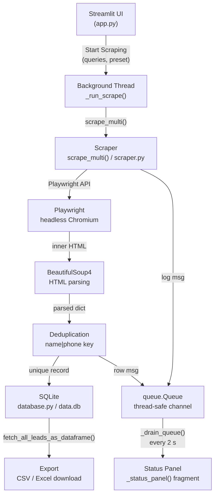

# Google Maps Scraper

> Headless Google Maps business-listing scraper with a Streamlit UI, SQLite persistence, and CSV/Excel export.


## Table of Contents

1. [Features](#features)
2. [Architecture](#architecture)
3. [Requirements](#requirements)
4. [Installation](#installation)
5. [Running the app](#running-the-app)
6. [Usage walkthrough](#usage-walkthrough)
7. [Configuration — speed presets](#configuration--speed-presets)
8. [Output schema](#output-schema)
9. [Database](#database)
10. [Export](#export)
11. [Project structure](#project-structure)
12. [Running tests](#running-tests)
13. [Contributing](#contributing)
14. [Legal notice](#legal-notice)

---

## Features

- **Multi-query scraping** — enter any number of Google Maps search queries (one per line); each runs as an independent search session.
- **Stealth automation** — Playwright Chromium with `playwright-stealth` patches to reduce bot-detection fingerprinting.
- **Consent-dialog dismissal** — automatically clicks "Accept all" (English, German, French, Portuguese) before scraping begins.
- **Media blocking** — images and fonts are aborted to reduce bandwidth and speed up page loads.
- **End-of-list detection** — scrolls the Maps feed until the "You've reached the end of the list" notice appears or three consecutive scrolls produce no new content.
- **Deduplication** — results across all queries are merged and deduplicated by `name|phone` key before saving.
- **SQLite persistence** — all leads stored in `data.db`; duplicate `google_id` values are silently ignored.
- **Live status panel** — Streamlit fragment auto-refreshes every 2 s during scraping: shows total leads in DB, leads this session, scraping status, and current query.
- **Live log viewer** — expandable terminal-style panel showing the last 50 log lines.
- **Speed presets** — Slow (15–30 s), Normal (5–15 s), Fast (1.5–5 s) inter-query delays.
- **Export** — download all leads as timestamped CSV or Excel (`.xlsx`) with one click.

---

## Architecture



**Module responsibilities:**

| Module | File | Responsibility |
|--------|------|-----------------|
| Scraper | `scraper.py` | Playwright automation, HTML parsing, deduplication |
| Database | `database.py` | SQLite schema, insert-or-ignore, DataFrame fetch |
| UI | `app.py` | Streamlit layout, threading, queue drain, export |

---

## Requirements

| Requirement | Minimum version | Notes |
|-------------|-----------------|-------|
| Python | 3.11 | `setup.sh` enforces this at install time |
| pip | any recent | upgraded to latest inside venv by `setup.sh` |
| Chromium | bundled | downloaded by `playwright install chromium` |
| OS | Linux / macOS / Windows WSL2 | headless Chromium works on all three |

> **Note:** Chromium is downloaded once into Playwright's local cache (~120 MB). No system-level Chrome install needed.

---

## Installation

```bash
# 1. Clone the repository
git clone <repo-url>
cd google-map-scraper

# 2. Run the automated setup script
#    — checks Python ≥ 3.11
#    — creates .venv/
#    — pip-installs all requirements
#    — downloads Playwright's Chromium binary
bash setup.sh
```

> **What `setup.sh` does, step by step:**
> 1. Verifies `python3` is on PATH and is ≥ 3.11 (exits with error if not).
> 2. Creates `.venv/` with `python3 -m venv .venv`.
> 3. Activates the venv.
> 4. Upgrades pip.
> 5. Runs `pip install -r requirements.txt`.
> 6. Runs `playwright install chromium` to fetch the headless Chromium binary.

**Manual install (if you prefer not to use `setup.sh`):**

```bash
python3 -m venv .venv
source .venv/bin/activate          # Windows: .venv\Scripts\activate
pip install --upgrade pip
pip install -r requirements.txt
playwright install chromium
```

**Dependency list** (`requirements.txt`):

```
playwright>=1.44
playwright-stealth
beautifulsoup4
lxml
pandas
streamlit
pytest
openpyxl
```

---

## Running the app

```bash
# Activate the venv first (skip if already active)
source .venv/bin/activate

# Launch Streamlit
streamlit run app.py
```

Streamlit opens `http://localhost:8501` in your default browser automatically.  
If the browser does not open, navigate there manually.

> **Headless server / SSH:** Streamlit binds to `0.0.0.0:8501` by default. Add `--server.headless true` if running on a remote host:
> ```bash
> streamlit run app.py --server.headless true
> ```

---

## Usage walkthrough

### 1. Enter search queries

In the **Control Panel** sidebar, type one Google Maps search query per line into the **Search queries** text area.

```
coffee shops london
plumbers new york
restaurants berlin
```

Each line becomes an independent Google Maps search (`https://www.google.com/maps/search/<query>`).

### 2. Choose execution speed

Select a preset from the **Execution speed** dropdown:

| Label | Preset key | Inter-query delay |
|-------|------------|-------------------|
| Normal (default) | `normal` | 5–15 s |
| Slow (cautious) | `slow` | 15–30 s |
| Fast | `fast` | 1.5–5 s |

Use **Slow** when scraping many queries on the same IP to reduce detection risk.  
Use **Fast** for quick exploratory runs or when you have a fresh IP.

### 3. Start scraping

Click **▶ Start Scraping**. The button is disabled if:
- No queries have been entered, or
- A scrape is already in progress.

### 4. Watch live status

The status panel auto-refreshes every 2 seconds:

- **Total leads in DB** — cumulative count across all sessions.
- **Leads this session** — count for the current run.
- **Status** — `⟳ Scraping…` while running, `✓ Idle` when done.
- **Current query** — the query being processed right now.
- **Live log** — expandable terminal panel showing the last 50 log entries.

If an error occurs (network issue, selector change, etc.) an error banner appears below the metrics.

### 5. View collected leads

The **Collected Leads** table shows all rows stored in `data.db`.  
Columns: name, rating (⭐), reviews, phone, website (clickable link), scraped_at.

### 6. Export

Once scraping finishes (or at any time), scroll to **Export Leads**:

- **Download CSV** — UTF-8 encoded CSV, filename `leads_YYYYMMDD_HHMMSS.csv`.
- **Download Excel** — `.xlsx` file, filename `leads_YYYYMMDD_HHMMSS.xlsx`.

---

## Configuration — speed presets

The scraper supports three execution presets that control the inter-query delay (pause between searches):

| Preset | Delay range | Use case |
|--------|-------------|----------|
| `slow` | 15–30 s | Conservative; many queries on same IP; reduce detection risk |
| `normal` | 5–15 s | Balanced; default; most runs |
| `fast` | 1.5–5 s | Quick testing; fresh IP; low query count |

Delays are randomised within the range to appear less bot-like. The actual delay for each query is chosen uniformly at random from the min and max values.

---

## Output schema

Each scraped business record has the following fields.

### Scraper output dict (from `scraper.py`)

| Field | Type | Source |
|-------|------|--------|
| `name` | `str` | `aria-label` on the place link, or `[role="heading"]` text |
| `rating` | `str` | `aria-label` containing "stars" or "out of 5" |
| `reviews` | `str` | Parenthesised number, e.g. `(1,234)` |
| `phone` | `str` | `[data-item-id*="phone"]` element, or regex match |
| `website` | `str` | `a[data-item-id="authority"]` href |

All fields default to `''` if extraction fails — the record is kept as long as `name` is non-empty.

### Database row (from `database.py`)

| Column | SQLite type | Notes |
|--------|-------------|-------|
| `id` | `INTEGER PRIMARY KEY` | Auto-increment |
| `google_id` | `TEXT UNIQUE NOT NULL` | MD5 of `name\|phone` — dedup key |
| `name` | `TEXT` | Business name |
| `rating` | `REAL` | Numeric rating, e.g. `4.5` |
| `reviews_count` | `INTEGER` | Review count |
| `phone` | `TEXT` | Phone number as extracted |
| `website` | `TEXT` | Website URL |
| `address` | `TEXT` | Reserved — currently always `''` |
| `category` | `TEXT` | Reserved — currently always `''` |
| `scraped_at` | `TIMESTAMP` | UTC ISO-8601 string |

---

## Database

Data is stored in **`data.db`** (SQLite) in the project root directory.  
The file is created automatically on first run via `database.initialize_db()`.

```bash
# Inspect the database directly
sqlite3 data.db "SELECT name, rating, phone FROM leads LIMIT 10;"
```

**Deduplication:** `INSERT OR IGNORE` on `google_id` (MD5 of `name|phone`) means the same business scraped multiple times is stored only once. Running the same query twice is safe.

**Backup:** copy `data.db` to preserve your leads. The file is plain SQLite — any SQLite-compatible tool can read it.

**Reset:** delete `data.db` to start fresh. The app will recreate it on next launch.

---

## Export

The UI supports two export formats, both accessible from the **Export Leads** section at the bottom of the page:

**CSV:** 
- UTF-8 encoded
- Standard comma-delimited format
- Filename: `leads_YYYYMMDD_HHMMSS.csv`
- Opens in Excel, Google Sheets, or any text editor

**Excel (.xlsx):**
- Microsoft Excel format with formatting preserved
- Filename: `leads_YYYYMMDD_HHMMSS.xlsx`
- Ideal for further analysis or sharing with non-technical users

Both exports include all columns from the database (id, google_id, name, rating, reviews_count, phone, website, address, category, scraped_at) and all rows collected so far.

---

## Project structure

```
google-map-scraper/
├── app.py              # Streamlit UI — layout, threading, queue drain, export
├── scraper.py          # Playwright automation and HTML parsing
├── database.py         # SQLite persistence (initialize, save, fetch, count)
├── requirements.txt    # Python dependencies
├── setup.sh            # One-shot install script (venv + Playwright Chromium)
├── data.db             # SQLite database — created on first run (gitignored)
├── tests/
│   ├── test_app_helpers.py      # Unit tests: _adapt_lead, _df_to_csv_bytes, etc.
│   ├── test_app_threading.py    # Unit tests: _drain_queue, _run_scrape
│   ├── test_database.py         # Integration tests: initialize_db, save_lead
│   ├── test_scraper.py          # Unit tests: all scraper helpers
│   ├── test_scraper_callbacks.py # Unit tests: row_callback / log_callback wiring
│   └── test_scraper_delay.py    # Unit tests: speed-preset delay constants
└── docs/
    └── superpowers/
        └── specs/      # Implementation plans
```

Key design constraints:
- `scraper.py` has **no Streamlit dependency** — it is pure automation logic and is fully unit-testable without a browser via mocks.
- `database.py` has **no Streamlit or scraper dependency** — it is a standalone persistence layer.
- `app.py` **imports** both `scraper` and `database` (`db`).

---

## Running tests

```bash
# Activate venv first
source .venv/bin/activate

# Run all tests
pytest

# Run with coverage report
pytest --cov=. --cov-report=term-missing

# Run a specific test file
pytest tests/test_scraper.py -v

# Run a specific test class
pytest tests/test_scraper.py::TestScrollFeed -v
```

**Test suite overview:**

| File | What it tests | Uses real browser? |
|------|---------------|--------------------|
| `test_scraper.py` | All `scraper.py` helpers | No — Playwright mocked |
| `test_scraper_callbacks.py` | `scrape_multi` callback wiring | No — Playwright mocked |
| `test_scraper_delay.py` | Speed-preset delay constants | No |
| `test_app_helpers.py` | `_adapt_lead`, export helpers | No |
| `test_app_threading.py` | `_drain_queue`, `_run_scrape` | No |
| `test_database.py` | SQLite round-trips | Yes — uses temp `data.db` |

> Tests do **not** hit a live Google Maps endpoint. Playwright calls are mocked with `unittest.mock`. Only `test_database.py` touches the filesystem (a temp SQLite file).

---

## Contributing

1. Fork the repository and create a feature branch: `git checkout -b feat/my-feature`.
2. Make changes. Keep `scraper.py`, `database.py`, and `app.py` decoupled — no cross-layer imports beyond those already present.
3. Write or update tests. Run `pytest` before committing.
4. Open a pull request with a clear description of what changed and why.

**Code style:** no formatter is enforced — follow the conventions already in the file you are editing (snake_case, type annotations, docstrings only for public functions).

**Adding a new export format:** implement a `_df_to_<format>_bytes(df)` function in `app.py` (see `_df_to_csv_bytes` and `_df_to_excel_bytes`), then add a `st.download_button` in the Export section.

**Adding a new data field:** update the following in order:
1. `scraper.py` — add `_extract_<field>(soup)` and include the key in `_parse_business_node`.
2. `database.py` — add the column to `_CREATE_TABLE_SQL` and `_INSERT_SQL` and map it in `save_lead`.
3. `app.py` — add the column to `_adapt_lead` and to the `column_config` dict in the dataframe display.

---

## Legal notice

This tool is provided for **educational and research purposes only**.

Scraping Google Maps may violate [Google's Terms of Service](https://policies.google.com/terms). Before using this tool:

- Review Google's ToS and ensure your use case is permitted.
- Do not use this tool for commercial data harvesting without explicit authorisation.
- Respect `robots.txt` and rate limits — use the **Slow** preset for large runs.
- The authors accept no liability for misuse of this software.
