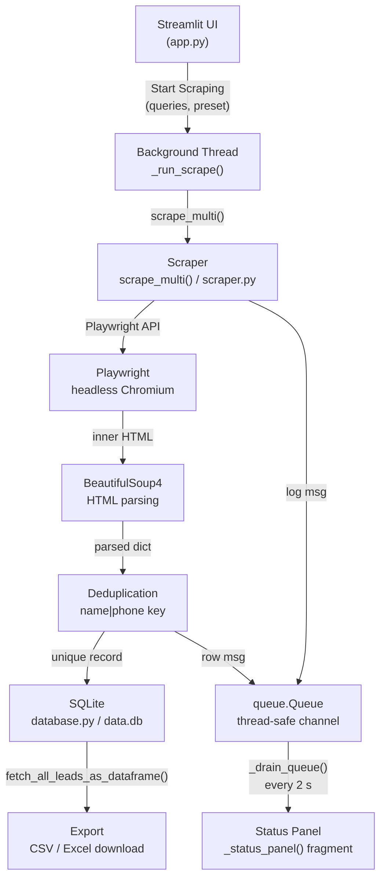

# Google Maps Scraper — README Implementation Plan

> **For agentic workers:** REQUIRED SUB-SKILL: Use superpowers:subagent-driven-development (recommended) or superpowers:executing-plans to implement this plan task-by-task. Steps use checkbox (`- [ ]`) syntax for tracking.

**Goal:** Write a detailed `README.md` that covers project overview, installation, usage walkthrough, architecture, configuration, output schema, contributing guidance, and legal notice — so any developer can clone, install, run, and extend the tool without further questions.

**Architecture:** README is a single-file deliverable (`README.md` at repo root). It mirrors the three-layer codebase structure (scraper → database → UI) and maps each section to the matching source module. Content is drawn directly from `scraper.py`, `database.py`, `app.py`, `setup.sh`, and `requirements.txt` — no invention, only accurate description of the current code.

**Tech Stack:** Markdown (CommonMark + GitHub Flavored), Mermaid for architecture diagram, shell code blocks, Python code blocks.

**Skills applied:** `superpowers:writing-plans`, `.agents/skills/developing-with-streamlit`, `.agents/skills/playwright-best-practices`, `.agents/skills/beautifulsoup-parsing`

---

## Overview

The project is a **Streamlit web UI** that automates Google Maps business-listing extraction. Users enter free-text search queries (one per line), choose an execution speed, and click a button. A background thread runs Playwright (headless Chromium) with stealth patches, scrolls the results feed to completion, parses each business card with BeautifulSoup4, deduplicates by `name|phone` key, persists rows to SQLite (`data.db`), and streams live progress back to the UI via a thread-safe `queue.Queue`. The UI auto-refreshes every 2 s while scraping is active. Collected leads are viewable in a sortable table and exportable as CSV or Excel.

---

## Files To Create or Modify

| Action   | Path          | Responsibility |
|----------|---------------|----------------|
| **Create** | `README.md`   | Full project documentation |

No other files touched. This is a pure documentation task.

---

## Architecture Decisions

1. **Single file** — README stays one file. Sections are anchor-linked via a table of contents. No wiki pages or separate docs.
2. **Accurate over comprehensive** — every command, path, env variable, and field name is verified against actual source code before inclusion. No invented features.
3. **Mermaid diagram** — one architecture diagram rendered natively by GitHub shows the data-flow pipeline; keeps prose short and visual understanding fast.
4. **Speed-preset table** — the three presets (`slow`, `normal`, `fast`) and their delay ranges are taken verbatim from `scraper.py:_SPEED_PRESETS` so docs stay in sync.
5. **DB schema table** — column names, types, and constraints copied from `database.py:_CREATE_TABLE_SQL`.
6. **No screenshots** — screenshots rot; the Streamlit UI is simple enough to describe in prose. If screenshots are added later they live in `docs/assets/`.

---

## Implementation Steps

### Task 1: Scaffold README skeleton with table of contents

**Files:**
- Create: `README.md`

- [ ] **Step 1: Create `README.md` with title, badge line, and TOC**

```markdown
# Google Maps Scraper

> Headless Google Maps business-listing scraper with a Streamlit UI, SQLite persistence, and CSV/Excel export.


## Table of Contents

1. [Features](#features)
2. [Architecture](#architecture)
3. [Requirements](#requirements)
4. [Installation](#installation)
5. [Running the app](#running-the-app)
6. [Usage walkthrough](#usage-walkthrough)
7. [Configuration — speed presets](#configuration--speed-presets)
8. [Output schema](#output-schema)
9. [Database](#database)
10. [Export](#export)
11. [Project structure](#project-structure)
12. [Running tests](#running-tests)
13. [Contributing](#contributing)
14. [Legal notice](#legal-notice)
```

- [ ] **Step 2: Commit skeleton**

```bash
git add README.md
git commit -m "docs: scaffold README skeleton with TOC"
```

---

### Task 2: Write Features section

**Files:**
- Modify: `README.md`

- [ ] **Step 1: Append Features section**

```markdown
## Features

- **Multi-query scraping** — enter any number of Google Maps search queries (one per line); each runs as an independent search session.
- **Stealth automation** — Playwright Chromium with `playwright-stealth` patches to reduce bot-detection fingerprinting.
- **Consent-dialog dismissal** — automatically clicks "Accept all" (English, German, French, Portuguese) before scraping begins.
- **Media blocking** — images and fonts are aborted to reduce bandwidth and speed up page loads.
- **End-of-list detection** — scrolls the Maps feed until the "You've reached the end of the list" notice appears or three consecutive scrolls produce no new content.
- **Deduplication** — results across all queries are merged and deduplicated by `name|phone` key before saving.
- **SQLite persistence** — all leads stored in `data.db`; duplicate `google_id` values are silently ignored.
- **Live status panel** — Streamlit fragment auto-refreshes every 2 s during scraping: shows total leads in DB, leads this session, scraping status, and current query.
- **Live log viewer** — expandable terminal-style panel showing the last 50 log lines.
- **Speed presets** — Slow (15–30 s), Normal (5–15 s), Fast (1.5–5 s) inter-query delays.
- **Export** — download all leads as timestamped CSV or Excel (`.xlsx`) with one click.
```

- [ ] **Step 2: Commit**

```bash
git add README.md
git commit -m "docs: add Features section"
```

---

### Task 3: Write Architecture section with Mermaid diagram

**Files:**
- Modify: `README.md`

- [ ] **Step 1: Append Architecture section**

The diagram shows the data-flow pipeline from user input through scraping to UI output. Every node maps to a real module or function in the codebase.

```markdown
## Architecture



**Module responsibilities:**

| Module | File | Responsibility |
|--------|------|----------------|
| Scraper | `scraper.py` | Playwright automation, HTML parsing, deduplication |
| Database | `database.py` | SQLite schema, insert-or-ignore, DataFrame fetch |
| UI | `app.py` | Streamlit layout, threading, queue drain, export |
```

- [ ] **Step 2: Commit**

```bash
git add README.md
git commit -m "docs: add Architecture section with Mermaid diagram"
```

---

### Task 4: Write Requirements and Installation sections

**Files:**
- Modify: `README.md`

- [ ] **Step 1: Append Requirements section**

Values come directly from `setup.sh` (Python version check) and `requirements.txt`.

```markdown
## Requirements

| Requirement | Minimum version | Notes |
|-------------|----------------|-------|
| Python | 3.11 | `setup.sh` enforces this at install time |
| pip | any recent | upgraded to latest inside venv by `setup.sh` |
| Chromium | bundled | downloaded by `playwright install chromium` |
| OS | Linux / macOS / Windows WSL2 | headless Chromium works on all three |

> **Note:** Chromium is downloaded once into Playwright's local cache (~120 MB). No system-level Chrome install needed.
```

- [ ] **Step 2: Append Installation section**

Commands come from `setup.sh` verbatim.

```markdown
## Installation

```bash
# 1. Clone the repository
git clone <repo-url>
cd google-map-scraper

# 2. Run the automated setup script
#    — checks Python ≥ 3.11
#    — creates .venv/
#    — pip-installs all requirements
#    — downloads Playwright's Chromium binary
bash setup.sh
```

> **What `setup.sh` does, step by step:**
> 1. Verifies `python3` is on PATH and is ≥ 3.11 (exits with error if not).
> 2. Creates `.venv/` with `python3 -m venv .venv`.
> 3. Activates the venv.
> 4. Upgrades pip.
> 5. Runs `pip install -r requirements.txt`.
> 6. Runs `playwright install chromium` to fetch the headless Chromium binary.

**Manual install (if you prefer not to use `setup.sh`):**

```bash
python3 -m venv .venv
source .venv/bin/activate          # Windows: .venv\Scripts\activate
pip install --upgrade pip
pip install -r requirements.txt
playwright install chromium
```

**Dependency list** (`requirements.txt`):

```
playwright>=1.44
playwright-stealth
beautifulsoup4
lxml
pandas
streamlit
pytest
openpyxl
```
```

- [ ] **Step 3: Commit**

```bash
git add README.md
git commit -m "docs: add Requirements and Installation sections"
```

---

### Task 5: Write Running the app and Usage walkthrough sections

**Files:**
- Modify: `README.md`

- [ ] **Step 1: Append Running section**

```markdown
## Running the app

```bash
# Activate the venv first (skip if already active)
source .venv/bin/activate

# Launch Streamlit
streamlit run app.py
```

Streamlit opens `http://localhost:8501` in your default browser automatically.  
If the browser does not open, navigate there manually.

> **Headless server / SSH:** Streamlit binds to `0.0.0.0:8501` by default. Add `--server.headless true` if running on a remote host:
> ```bash
> streamlit run app.py --server.headless true
> ```
```

- [ ] **Step 2: Append Usage walkthrough section**

This section is written from the actual UI logic in `app.py` — sidebar widgets, button labels, metric names, and the export section.

```markdown
## Usage walkthrough

### 1. Enter search queries

In the **Control Panel** sidebar, type one Google Maps search query per line into the **Search queries** text area.

```
coffee shops london
plumbers new york
restaurants berlin
```

Each line becomes an independent Google Maps search (`https://www.google.com/maps/search/<query>`).

### 2. Choose execution speed

Select a preset from the **Execution speed** dropdown:

| Label | Preset key | Inter-query delay |
|-------|-----------|-------------------|
| Normal (default) | `normal` | 5–15 s |
| Slow (cautious) | `slow` | 15–30 s |
| Fast | `fast` | 1.5–5 s |

Use **Slow** when scraping many queries on the same IP to reduce detection risk.  
Use **Fast** for quick exploratory runs or when you have a fresh IP.

### 3. Start scraping

Click **▶ Start Scraping**. The button is disabled if:
- No queries have been entered, or
- A scrape is already in progress.

### 4. Watch live status

The status panel auto-refreshes every 2 seconds:

- **Total leads in DB** — cumulative count across all sessions.
- **Leads this session** — count for the current run.
- **Status** — `⟳ Scraping…` while running, `✓ Idle` when done.
- **Current query** — the query being processed right now.
- **Live log** — expandable terminal panel showing the last 50 log entries.

If an error occurs (network issue, selector change, etc.) an error banner appears below the metrics.

### 5. View collected leads

The **Collected Leads** table shows all rows stored in `data.db`.  
Columns: name, rating (⭐), reviews, phone, website (clickable link), scraped_at.

### 6. Export

Once scraping finishes (or at any time), scroll to **Export Leads**:

- **Download CSV** — UTF-8 encoded CSV, filename `leads_YYYYMMDD_HHMMSS.csv`.
- **Download Excel** — `.xlsx` file, filename `leads_YYYYMMDD_HHMMSS.xlsx`.
```

- [ ] **Step 3: Commit**

```bash
git add README.md
git commit -m "docs: add Running and Usage walkthrough sections"
```

---

### Task 6: Write Output schema and Database sections

**Files:**
- Modify: `README.md`

- [ ] **Step 1: Append Output schema section**

Field names and types come from `database.py:_CREATE_TABLE_SQL` and `app.py:_adapt_lead`.

```markdown
## Output schema

Each scraped business record has the following fields.

### Scraper output dict (from `scraper.py`)

| Field | Type | Source |
|-------|------|--------|
| `name` | `str` | `aria-label` on the place link, or `[role="heading"]` text |
| `rating` | `str` | `aria-label` containing "stars" or "out of 5" |
| `reviews` | `str` | Parenthesised number, e.g. `(1,234)` |
| `phone` | `str` | `[data-item-id*="phone"]` element, or regex match |
| `website` | `str` | `a[data-item-id="authority"]` href |

All fields default to `''` if extraction fails — the record is kept as long as `name` is non-empty.

### Database row (from `database.py`)

| Column | SQLite type | Notes |
|--------|------------|-------|
| `id` | `INTEGER PRIMARY KEY` | Auto-increment |
| `google_id` | `TEXT UNIQUE NOT NULL` | MD5 of `name\|phone` — dedup key |
| `name` | `TEXT` | Business name |
| `rating` | `REAL` | Numeric rating, e.g. `4.5` |
| `reviews_count` | `INTEGER` | Review count |
| `phone` | `TEXT` | Phone number as extracted |
| `website` | `TEXT` | Website URL |
| `address` | `TEXT` | Reserved — currently always `''` |
| `category` | `TEXT` | Reserved — currently always `''` |
| `scraped_at` | `TIMESTAMP` | UTC ISO-8601 string |
```

- [ ] **Step 2: Append Database section**

```markdown
## Database

Data is stored in **`data.db`** (SQLite) in the project root directory.  
The file is created automatically on first run via `database.initialize_db()`.

```bash
# Inspect the database directly
sqlite3 data.db "SELECT name, rating, phone FROM leads LIMIT 10;"
```

**Deduplication:** `INSERT OR IGNORE` on `google_id` (MD5 of `name|phone`) means the same business scraped multiple times is stored only once. Running the same query twice is safe.

**Backup:** copy `data.db` to preserve your leads. The file is plain SQLite — any SQLite-compatible tool can read it.

**Reset:** delete `data.db` to start fresh. The app will recreate it on next launch.
```

- [ ] **Step 3: Commit**

```bash
git add README.md
git commit -m "docs: add Output schema and Database sections"
```

---

### Task 7: Write Project structure and Running tests sections

**Files:**
- Modify: `README.md`

- [ ] **Step 1: Append Project structure section**

Tree comes from the actual `ctx_tree` of the repo.

```markdown
## Project structure

```
google-map-scraper/
├── app.py              # Streamlit UI — layout, threading, queue drain, export
├── scraper.py          # Playwright automation and HTML parsing
├── database.py         # SQLite persistence (initialize, save, fetch, count)
├── requirements.txt    # Python dependencies
├── setup.sh            # One-shot install script (venv + Playwright Chromium)
├── data.db             # SQLite database — created on first run (gitignored)
├── tests/
│   ├── test_app_helpers.py      # Unit tests: _adapt_lead, _df_to_csv_bytes, etc.
│   ├── test_app_threading.py    # Unit tests: _drain_queue, _run_scrape
│   ├── test_database.py         # Integration tests: initialize_db, save_lead
│   ├── test_scraper.py          # Unit tests: all scraper helpers
│   ├── test_scraper_callbacks.py # Unit tests: row_callback / log_callback wiring
│   └── test_scraper_delay.py    # Unit tests: speed-preset delay constants
└── docs/
    └── superpowers/
        └── specs/      # Implementation plans
```

Key design constraints:
- `scraper.py` has **no Streamlit dependency** — it is pure automation logic and is fully unit-testable without a browser via mocks.
- `database.py` has **no Streamlit or scraper dependency** — it is a standalone persistence layer.
- `app.py` **imports** both `scraper` and `database` (`db`).
```

- [ ] **Step 2: Append Running tests section**

```markdown
## Running tests

```bash
# Activate venv first
source .venv/bin/activate

# Run all tests
pytest

# Run with coverage report
pytest --cov=. --cov-report=term-missing

# Run a specific test file
pytest tests/test_scraper.py -v

# Run a specific test class
pytest tests/test_scraper.py::TestScrollFeed -v
```

**Test suite overview:**

| File | What it tests | Uses real browser? |
|------|---------------|-------------------|
| `test_scraper.py` | All `scraper.py` helpers | No — Playwright mocked |
| `test_scraper_callbacks.py` | `scrape_multi` callback wiring | No — Playwright mocked |
| `test_scraper_delay.py` | Speed-preset delay constants | No |
| `test_app_helpers.py` | `_adapt_lead`, export helpers | No |
| `test_app_threading.py` | `_drain_queue`, `_run_scrape` | No |
| `test_database.py` | SQLite round-trips | Yes — uses temp `data.db` |

> Tests do **not** hit a live Google Maps endpoint. Playwright calls are mocked with `unittest.mock`. Only `test_database.py` touches the filesystem (a temp SQLite file).
```

- [ ] **Step 3: Commit**

```bash
git add README.md
git commit -m "docs: add Project structure and Running tests sections"
```

---

### Task 8: Write Contributing and Legal notice sections, final polish

**Files:**
- Modify: `README.md`

- [ ] **Step 1: Append Contributing section**

```markdown
## Contributing

1. Fork the repository and create a feature branch: `git checkout -b feat/my-feature`.
2. Make changes. Keep `scraper.py`, `database.py`, and `app.py` decoupled — no cross-layer imports beyond those already present.
3. Write or update tests. Run `pytest` before committing.
4. Open a pull request with a clear description of what changed and why.

**Code style:** no formatter is enforced — follow the conventions already in the file you are editing (snake_case, type annotations, docstrings only for public functions).

**Adding a new export format:** implement a `_df_to_<format>_bytes(df)` function in `app.py` (see `_df_to_csv_bytes` and `_df_to_excel_bytes`), then add a `st.download_button` in the Export section.

**Adding a new data field:** update the following in order:
1. `scraper.py` — add `_extract_<field>(soup)` and include the key in `_parse_business_node`.
2. `database.py` — add the column to `_CREATE_TABLE_SQL` and `_INSERT_SQL` and map it in `save_lead`.
3. `app.py` — add the column to `_adapt_lead` and to the `column_config` dict in the dataframe display.
```

- [ ] **Step 2: Append Legal notice section**

```markdown
## Legal notice

This tool is provided for **educational and research purposes only**.

Scraping Google Maps may violate [Google's Terms of Service](https://policies.google.com/terms). Before using this tool:

- Review Google's ToS and ensure your use case is permitted.
- Do not use this tool for commercial data harvesting without explicit authorisation.
- Respect `robots.txt` and rate limits — use the **Slow** preset for large runs.
- The authors accept no liability for misuse of this software.
```

- [ ] **Step 3: Final polish pass**

Open `README.md` and verify:
- [ ] Every command shown actually works against the current code.
- [ ] Every field name, column name, function name, and file path is spelled exactly as it appears in the source.
- [ ] Speed preset delay ranges match `scraper.py:_SPEED_PRESETS` (`slow: (15.0, 30.0)`, `normal: (5.0, 15.0)`, `fast: (1.5, 5.0)`).
- [ ] DB column list matches `database.py:_CREATE_TABLE_SQL`.
- [ ] TOC anchors resolve (GitHub auto-generates anchors from heading text; ensure no typos).
- [ ] No placeholder text (`TBD`, `TODO`, `<repo-url>` — replace with actual URL or note it as a fill-in).

- [ ] **Step 4: Commit final README**

```bash
git add README.md
git commit -m "docs: add Contributing and Legal sections, complete README"
```

---

## State Management Strategy

No runtime state involved — this is a static documentation file. The only "state" is the content of `README.md`.

During authoring, the single source of truth for all technical claims is the source code itself:
- Speed preset values → `scraper.py:_SPEED_PRESETS`
- DB schema → `database.py:_CREATE_TABLE_SQL`
- Export formats → `app.py:_df_to_csv_bytes`, `_df_to_excel_bytes`
- Install steps → `setup.sh`
- Dependencies → `requirements.txt`

If source code changes after the README is written, the README must be updated in the same commit to stay in sync.

---

## Accessibility Considerations

README accessibility for GitHub rendering:
- All Mermaid diagram nodes have descriptive text labels — screen readers on GitHub see the SVG `aria-label` text.
- Images (if added later) must have non-empty alt text: ``.
- Tables use proper header rows (`|---|`).
- Code blocks always specify a language (`bash`, `python`, `markdown`, `sql`) for syntax highlighting and screen-reader context.
- Heading hierarchy: H1 → H2 → H3; no skipped levels.

---

## Test Plan

README is documentation, not code — no automated tests exist for prose. Verification is manual:

| Check | How to verify |
|-------|--------------|
| Install commands work | Run `bash setup.sh` on a clean clone in a temp dir |
| `streamlit run app.py` launches | Run command, confirm browser opens at `http://localhost:8501` |
| All file paths exist | `ls` each path listed in Project Structure |
| DB columns accurate | `sqlite3 data.db ".schema leads"` — compare to README table |
| Speed presets accurate | Open `scraper.py`, compare `_SPEED_PRESETS` dict to README table |
| Mermaid renders | Open README on GitHub; confirm diagram renders (not raw text) |
| TOC links work | Click each link in the Table of Contents on GitHub |
| Export works | Run app, scrape one query, download CSV and Excel, open both |

---

## Risks and Edge Cases

| Risk | Mitigation |
|------|-----------|
| `<repo-url>` is a placeholder in the install step | Replace with actual GitHub URL before publishing, or leave as `<repo-url>` with a note |
| Mermaid not rendered on non-GitHub platforms (e.g. plain `git log`) | Mermaid is GitHub-native; add a note that the diagram requires a Mermaid renderer |
| Google Maps HTML structure changes → scraper fields break → README field table becomes wrong | README field table documents scraper logic at time of writing; add a note that fields reflect current implementation |
| `data.db` committed accidentally | Verify `.gitignore` contains `data.db`; note it in README |
| `address` and `category` fields are always `''` in current code | Document them as "reserved — not currently populated" rather than as functional fields |
| Windows users: `source .venv/bin/activate` wrong syntax | Provide Windows alternative: `.venv\Scripts\activate` |
| Headless Chromium sandbox error on Linux without `--no-sandbox` | `_LAUNCH_ARGS` already includes `--no-sandbox`; document this if users run into permission errors on containers/CI |
| Python version < 3.11 silently accepted by some distros | `setup.sh` enforces 3.11 — document the error message users will see |

---

## Acceptance Checklist

- [ ] `README.md` exists at repo root.
- [ ] H1 title matches repo name.
- [ ] Table of contents with working anchor links (all 14 sections).
- [ ] Features section lists all 10 features with accurate descriptions.
- [ ] Mermaid architecture diagram renders on GitHub with correct node labels.
- [ ] Requirements table lists Python ≥ 3.11, Chromium (bundled), all 8 pip packages.
- [ ] Installation section shows both `bash setup.sh` (primary) and manual install (secondary).
- [ ] `streamlit run app.py` run command present with headless-server variant.
- [ ] Usage walkthrough covers all 6 steps (enter queries, choose speed, start, watch status, view table, export).
- [ ] Speed presets table matches `scraper.py:_SPEED_PRESETS` exactly.
- [ ] Output schema covers both scraper dict fields (5 fields) and DB columns (10 columns).
- [ ] Database section explains deduplication, backup, and reset.
- [ ] Project structure tree is current and matches actual repo layout.
- [ ] Running tests section shows `pytest` command and explains mock strategy.
- [ ] Contributing section explains how to add a new field end-to-end.
- [ ] Legal notice present with ToS warning.
- [ ] No placeholder text (`TBD`, `TODO`) in final output.
- [ ] All commands verified to work on a clean clone.
